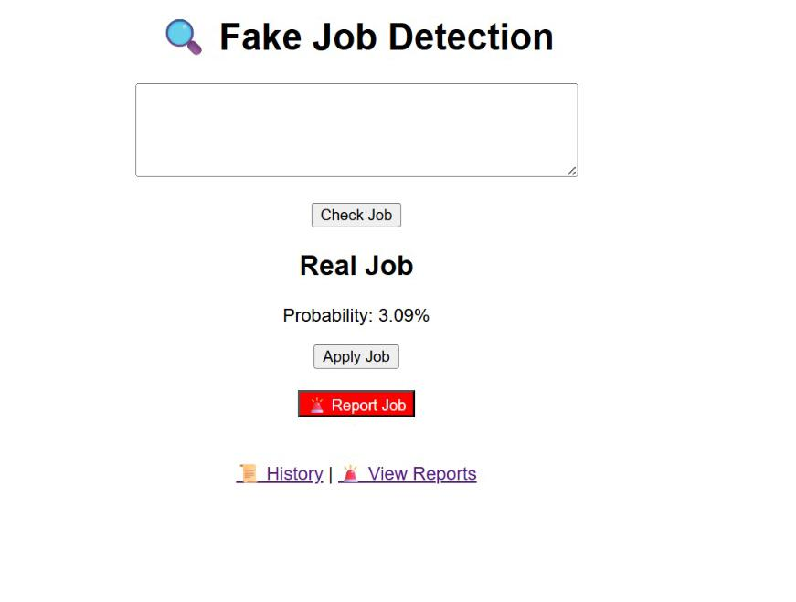
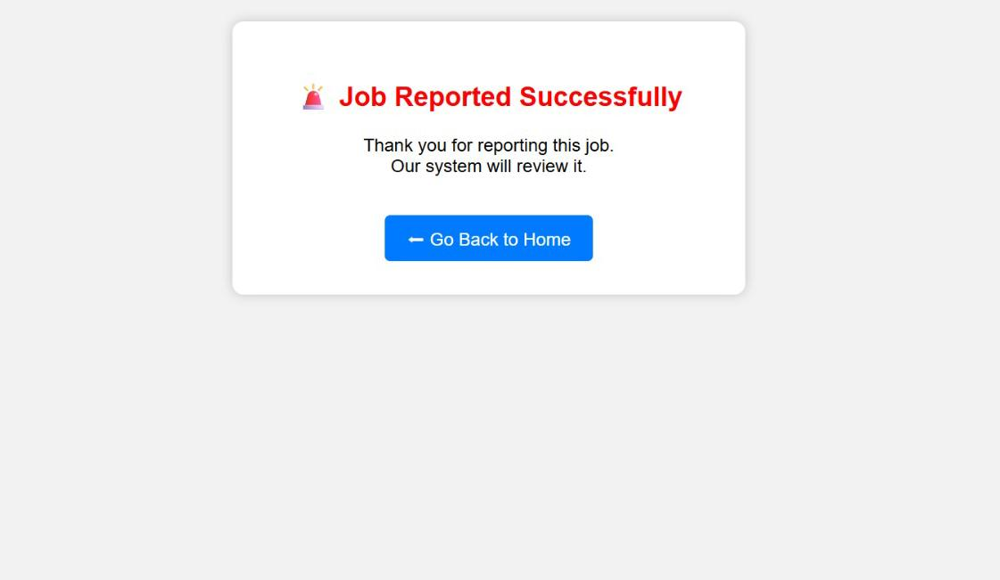
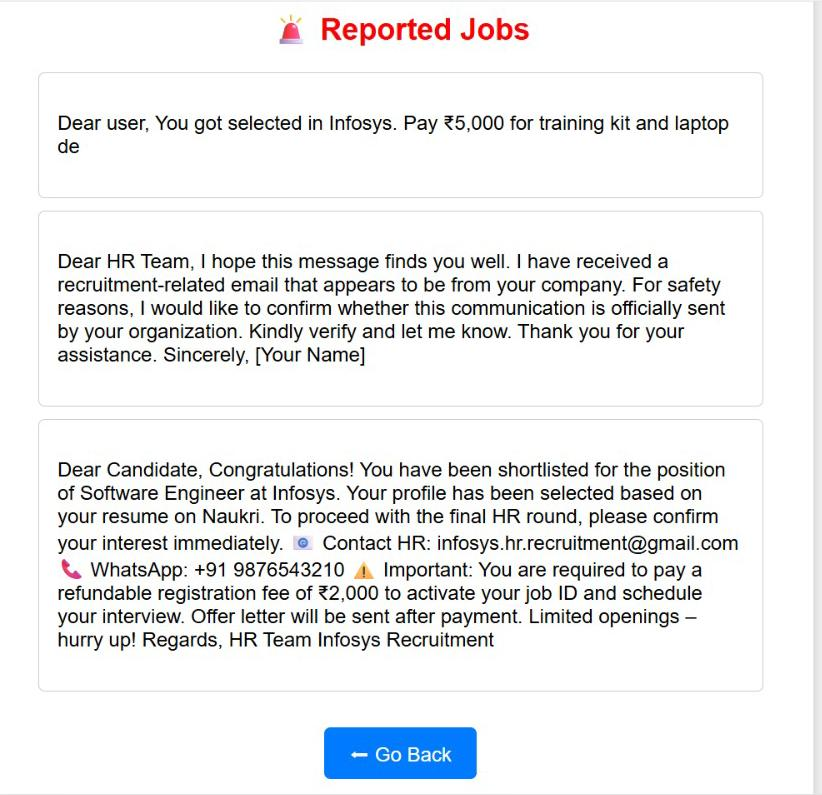
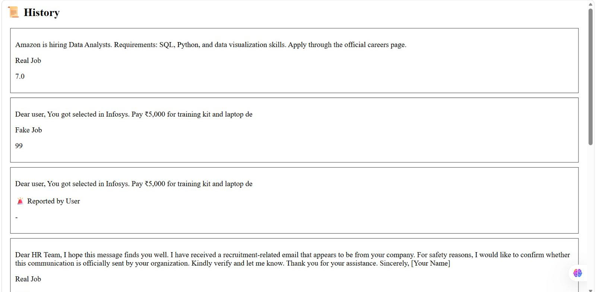

#  Fake Job Detection System

A web application that helps users detect fake job offers and avoid scams.

# Overview
This system analyzes job descriptions and identifies whether a job is Real, Suspicious, or Fake using pattern-based logic.

# Features
- Fake job detection  
- Risk classification (Low, Medium, High)  
- Company name detection  
- WhatsApp scam detection  
- Verification via Google & LinkedIn  
- History tracking  

# How It Works
1. Enter job description  
2. System analyzes content  
3. Detects scam patterns  
4. Shows prediction, risk, and verification links  

# Tech Stack
- Frontend: HTML, CSS, JavaScript  
- Backend: Python (FastAPI)

 # Dataset
We analyzed fake job datasets from Kaggle to understand scam patterns and built rule-based detection based on those insights.

# How to Run

1. Install dependencies:
pip install fastapi uvicorn

2. Run backend:
uvicorn main:app --reload

3. Open index.html in browser

# Example

Input:
Join via WhatsApp and earn 5000 per day urgently

Output:
Fake Job ❌
High Risk

#  Demo

#Conclusion
This project helps users identify fake job offers and stay safe from scams.
